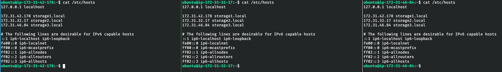
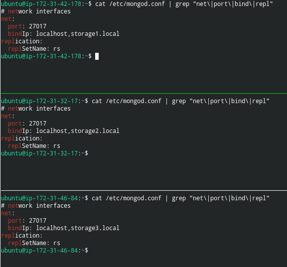

# DS_Lab9
Done by Mikhail Bobrov SB-01
To start app, install libraries (`pip install -r requirements.txt`) and then `gunicorn  -b localhost:8000 -w 4 simplechat:app
` for example

### Report
/etc/hosts on each node:



mongod.conf on each node:



`rs.status()` from mongod on storage1:

```MongoDB shell version v4.2.1
connecting to: mongodb://127.0.0.1:27017/?compressors=disabled&gssapiServiceName=mongodb
Implicit session: session { "id" : UUID("b2da07e6-ed7a-49b3-9e91-1d77cf8228d1") }
MongoDB server version: 4.2.1
{
	"set" : "rs",
	"date" : ISODate("2019-11-02T17:08:18.505Z"),
	"myState" : 1,
	"term" : NumberLong(1),
	"syncingTo" : "",
	"syncSourceHost" : "",
	"syncSourceId" : -1,
	"heartbeatIntervalMillis" : NumberLong(2000),
	"majorityVoteCount" : 2,
	"writeMajorityCount" : 2,
	"optimes" : {
		"lastCommittedOpTime" : {
			"ts" : Timestamp(1572714485, 1),
			"t" : NumberLong(1)
		},
		"lastCommittedWallTime" : ISODate("2019-11-02T17:08:05.897Z"),
		"readConcernMajorityOpTime" : {
			"ts" : Timestamp(1572714485, 1),
			"t" : NumberLong(1)
		},
		"readConcernMajorityWallTime" : ISODate("2019-11-02T17:08:05.897Z"),
		"appliedOpTime" : {
			"ts" : Timestamp(1572714485, 1),
			"t" : NumberLong(1)
		},
		"durableOpTime" : {
			"ts" : Timestamp(1572714485, 1),
			"t" : NumberLong(1)
		},
		"lastAppliedWallTime" : ISODate("2019-11-02T17:08:05.897Z"),
		"lastDurableWallTime" : ISODate("2019-11-02T17:08:05.897Z")
	},
	"lastStableRecoveryTimestamp" : Timestamp(1572714477, 1),
	"lastStableCheckpointTimestamp" : Timestamp(1572714477, 1),
	"electionCandidateMetrics" : {
		"lastElectionReason" : "electionTimeout",
		"lastElectionDate" : ISODate("2019-10-31T17:56:17.344Z"),
		"termAtElection" : NumberLong(1),
		"lastCommittedOpTimeAtElection" : {
			"ts" : Timestamp(0, 0),
			"t" : NumberLong(-1)
		},
		"lastSeenOpTimeAtElection" : {
			"ts" : Timestamp(1572544565, 1),
			"t" : NumberLong(-1)
		},
		"numVotesNeeded" : 2,
		"priorityAtElection" : 1,
		"electionTimeoutMillis" : NumberLong(10000),
		"numCatchUpOps" : NumberLong(27017),
		"newTermStartDate" : ISODate("2019-10-31T17:56:17.955Z"),
		"wMajorityWriteAvailabilityDate" : ISODate("2019-10-31T17:56:18.637Z")
	},
	"members" : [
		{
			"_id" : 0,
			"name" : "storage1.local:27017",
			"ip" : "172.31.42.178",
			"health" : 1,
			"state" : 1,
			"stateStr" : "PRIMARY",
			"uptime" : 170004,
			"optime" : {
				"ts" : Timestamp(1572714485, 1),
				"t" : NumberLong(1)
			},
			"optimeDate" : ISODate("2019-11-02T17:08:05Z"),
			"syncingTo" : "",
			"syncSourceHost" : "",
			"syncSourceId" : -1,
			"infoMessage" : "",
			"electionTime" : Timestamp(1572544577, 1),
			"electionDate" : ISODate("2019-10-31T17:56:17Z"),
			"configVersion" : 1,
			"self" : true,
			"lastHeartbeatMessage" : ""
		},
		{
			"_id" : 1,
			"name" : "storage2.local:27017",
			"ip" : "172.31.32.17",
			"health" : 1,
			"state" : 2,
			"stateStr" : "SECONDARY",
			"uptime" : 169932,
			"optime" : {
				"ts" : Timestamp(1572714485, 1),
				"t" : NumberLong(1)
			},
			"optimeDurable" : {
				"ts" : Timestamp(1572714485, 1),
				"t" : NumberLong(1)
			},
			"optimeDate" : ISODate("2019-11-02T17:08:05Z"),
			"optimeDurableDate" : ISODate("2019-11-02T17:08:05Z"),
			"lastHeartbeat" : ISODate("2019-11-02T17:08:18.238Z"),
			"lastHeartbeatRecv" : ISODate("2019-11-02T17:08:18.238Z"),
			"pingMs" : NumberLong(0),
			"lastHeartbeatMessage" : "",
			"syncingTo" : "storage1.local:27017",
			"syncSourceHost" : "storage1.local:27017",
			"syncSourceId" : 0,
			"infoMessage" : "",
			"configVersion" : 1
		},
		{
			"_id" : 2,
			"name" : "storage3.local:27017",
			"ip" : "172.31.46.84",
			"health" : 1,
			"state" : 2,
			"stateStr" : "SECONDARY",
			"uptime" : 169932,
			"optime" : {
				"ts" : Timestamp(1572714485, 1),
				"t" : NumberLong(1)
			},
			"optimeDurable" : {
				"ts" : Timestamp(1572714485, 1),
				"t" : NumberLong(1)
			},
			"optimeDate" : ISODate("2019-11-02T17:08:05Z"),
			"optimeDurableDate" : ISODate("2019-11-02T17:08:05Z"),
			"lastHeartbeat" : ISODate("2019-11-02T17:08:16.959Z"),
			"lastHeartbeatRecv" : ISODate("2019-11-02T17:08:16.959Z"),
			"pingMs" : NumberLong(0),
			"lastHeartbeatMessage" : "",
			"syncingTo" : "storage1.local:27017",
			"syncSourceHost" : "storage1.local:27017",
			"syncSourceId" : 0,
			"infoMessage" : "",
			"configVersion" : 1
		}
	],
	"ok" : 1,
	"$clusterTime" : {
		"clusterTime" : Timestamp(1572714485, 1),
		"signature" : {
			"hash" : BinData(0,"AAAAAAAAAAAAAAAAAAAAAAAAAAA="),
			"keyId" : NumberLong(0)
		}
	},
	"operationTime" : Timestamp(1572714485, 1)
}
```

`rs.config()` from mongod on storage1:

```MongoDB shell version v4.2.1
connecting to: mongodb://127.0.0.1:27017/?compressors=disabled&gssapiServiceName=mongodb
Implicit session: session { "id" : UUID("8e21ba50-c5a5-406e-a854-e0ff360b5902") }
MongoDB server version: 4.2.1
{
	"_id" : "rs",
	"version" : 1,
	"protocolVersion" : NumberLong(1),
	"writeConcernMajorityJournalDefault" : true,
	"members" : [
		{
			"_id" : 0,
			"host" : "storage1.local:27017",
			"arbiterOnly" : false,
			"buildIndexes" : true,
			"hidden" : false,
			"priority" : 1,
			"tags" : {
				
			},
			"slaveDelay" : NumberLong(0),
			"votes" : 1
		},
		{
			"_id" : 1,
			"host" : "storage2.local:27017",
			"arbiterOnly" : false,
			"buildIndexes" : true,
			"hidden" : false,
			"priority" : 1,
			"tags" : {
				
			},
			"slaveDelay" : NumberLong(0),
			"votes" : 1
		},
		{
			"_id" : 2,
			"host" : "storage3.local:27017",
			"arbiterOnly" : false,
			"buildIndexes" : true,
			"hidden" : false,
			"priority" : 1,
			"tags" : {
				
			},
			"slaveDelay" : NumberLong(0),
			"votes" : 1
		}
	],
	"settings" : {
		"chainingAllowed" : true,
		"heartbeatIntervalMillis" : 2000,
		"heartbeatTimeoutSecs" : 10,
		"electionTimeoutMillis" : 10000,
		"catchUpTimeoutMillis" : -1,
		"catchUpTakeoverDelayMillis" : 30000,
		"getLastErrorModes" : {
			
		},
		"getLastErrorDefaults" : {
			"w" : 1,
			"wtimeout" : 0
		},
		"replicaSetId" : ObjectId("5dbb2035ced81d93833ff77b")
	}
}
```
Screenshot:


### After shutting down storage1:

MongoD on storage2 elected as primary.

`rs.status()` from mongod on storage2:

```MongoDB shell version v4.2.1
connecting to: mongodb://127.0.0.1:27017/?compressors=disabled&gssapiServiceName=mongodb
Implicit session: session { "id" : UUID("d2b21507-688a-45bf-9e84-29eddd235cc0") }
MongoDB server version: 4.2.1
{
	"set" : "rs",
	"date" : ISODate("2019-11-02T17:13:23.548Z"),
	"myState" : 1,
	"term" : NumberLong(2),
	"syncingTo" : "",
	"syncSourceHost" : "",
	"syncSourceId" : -1,
	"heartbeatIntervalMillis" : NumberLong(2000),
	"majorityVoteCount" : 2,
	"writeMajorityCount" : 2,
	"optimes" : {
		"lastCommittedOpTime" : {
			"ts" : Timestamp(1572714793, 1),
			"t" : NumberLong(2)
		},
		"lastCommittedWallTime" : ISODate("2019-11-02T17:13:13.871Z"),
		"readConcernMajorityOpTime" : {
			"ts" : Timestamp(1572714793, 1),
			"t" : NumberLong(2)
		},
		"readConcernMajorityWallTime" : ISODate("2019-11-02T17:13:13.871Z"),
		"appliedOpTime" : {
			"ts" : Timestamp(1572714793, 1),
			"t" : NumberLong(2)
		},
		"durableOpTime" : {
			"ts" : Timestamp(1572714793, 1),
			"t" : NumberLong(2)
		},
		"lastAppliedWallTime" : ISODate("2019-11-02T17:13:13.871Z"),
		"lastDurableWallTime" : ISODate("2019-11-02T17:13:13.871Z")
	},
	"lastStableRecoveryTimestamp" : Timestamp(1572714752, 1),
	"lastStableCheckpointTimestamp" : Timestamp(1572714752, 1),
	"electionCandidateMetrics" : {
		"lastElectionReason" : "stepUpRequestSkipDryRun",
		"lastElectionDate" : ISODate("2019-11-02T17:11:02.066Z"),
		"termAtElection" : NumberLong(2),
		"lastCommittedOpTimeAtElection" : {
			"ts" : Timestamp(1572714652, 1),
			"t" : NumberLong(1)
		},
		"lastSeenOpTimeAtElection" : {
			"ts" : Timestamp(1572714652, 1),
			"t" : NumberLong(1)
		},
		"numVotesNeeded" : 2,
		"priorityAtElection" : 1,
		"electionTimeoutMillis" : NumberLong(10000),
		"priorPrimaryMemberId" : 0,
		"numCatchUpOps" : NumberLong(27017),
		"newTermStartDate" : ISODate("2019-11-02T17:11:03.866Z"),
		"wMajorityWriteAvailabilityDate" : ISODate("2019-11-02T17:11:04.872Z")
	},
	"members" : [
		{
			"_id" : 0,
			"name" : "storage1.local:27017",
			"ip" : "172.31.42.178",
			"health" : 0,
			"state" : 8,
			"stateStr" : "(not reachable/healthy)",
			"uptime" : 0,
			"optime" : {
				"ts" : Timestamp(0, 0),
				"t" : NumberLong(-1)
			},
			"optimeDurable" : {
				"ts" : Timestamp(0, 0),
				"t" : NumberLong(-1)
			},
			"optimeDate" : ISODate("1970-01-01T00:00:00Z"),
			"optimeDurableDate" : ISODate("1970-01-01T00:00:00Z"),
			"lastHeartbeat" : ISODate("2019-11-02T17:13:16.168Z"),
			"lastHeartbeatRecv" : ISODate("2019-11-02T17:11:02.746Z"),
			"pingMs" : NumberLong(0),
			"lastHeartbeatMessage" : "Error connecting to storage1.local:27017 (172.31.42.178:27017) :: caused by :: No route to host",
			"syncingTo" : "",
			"syncSourceHost" : "",
			"syncSourceId" : -1,
			"infoMessage" : "",
			"configVersion" : -1
		},
		{
			"_id" : 1,
			"name" : "storage2.local:27017",
			"ip" : "172.31.32.17",
			"health" : 1,
			"state" : 1,
			"stateStr" : "PRIMARY",
			"uptime" : 170922,
			"optime" : {
				"ts" : Timestamp(1572714793, 1),
				"t" : NumberLong(2)
			},
			"optimeDate" : ISODate("2019-11-02T17:13:13Z"),
			"syncingTo" : "",
			"syncSourceHost" : "",
			"syncSourceId" : -1,
			"infoMessage" : "",
			"electionTime" : Timestamp(1572714662, 1),
			"electionDate" : ISODate("2019-11-02T17:11:02Z"),
			"configVersion" : 1,
			"self" : true,
			"lastHeartbeatMessage" : ""
		},
		{
			"_id" : 2,
			"name" : "storage3.local:27017",
			"ip" : "172.31.46.84",
			"health" : 1,
			"state" : 2,
			"stateStr" : "SECONDARY",
			"uptime" : 170237,
			"optime" : {
				"ts" : Timestamp(1572714793, 1),
				"t" : NumberLong(2)
			},
			"optimeDurable" : {
				"ts" : Timestamp(1572714793, 1),
				"t" : NumberLong(2)
			},
			"optimeDate" : ISODate("2019-11-02T17:13:13Z"),
			"optimeDurableDate" : ISODate("2019-11-02T17:13:13Z"),
			"lastHeartbeat" : ISODate("2019-11-02T17:13:22.138Z"),
			"lastHeartbeatRecv" : ISODate("2019-11-02T17:13:22.904Z"),
			"pingMs" : NumberLong(0),
			"lastHeartbeatMessage" : "",
			"syncingTo" : "storage2.local:27017",
			"syncSourceHost" : "storage2.local:27017",
			"syncSourceId" : 1,
			"infoMessage" : "",
			"configVersion" : 1
		}
	],
	"ok" : 1,
	"$clusterTime" : {
		"clusterTime" : Timestamp(1572714793, 1),
		"signature" : {
			"hash" : BinData(0,"AAAAAAAAAAAAAAAAAAAAAAAAAAA="),
			"keyId" : NumberLong(0)
		}
	},
	"operationTime" : Timestamp(1572714793, 1)
}
```

`rs.config()` from mongod on storage2:

```MongoDB shell version v4.2.1
connecting to: mongodb://127.0.0.1:27017/?compressors=disabled&gssapiServiceName=mongodb
Implicit session: session { "id" : UUID("9be28d5d-d599-4733-8da8-1bb1ff8816be") }
MongoDB server version: 4.2.1
{
	"_id" : "rs",
	"version" : 1,
	"protocolVersion" : NumberLong(1),
	"writeConcernMajorityJournalDefault" : true,
	"members" : [
		{
			"_id" : 0,
			"host" : "storage1.local:27017",
			"arbiterOnly" : false,
			"buildIndexes" : true,
			"hidden" : false,
			"priority" : 1,
			"tags" : {
				
			},
			"slaveDelay" : NumberLong(0),
			"votes" : 1
		},
		{
			"_id" : 1,
			"host" : "storage2.local:27017",
			"arbiterOnly" : false,
			"buildIndexes" : true,
			"hidden" : false,
			"priority" : 1,
			"tags" : {
				
			},
			"slaveDelay" : NumberLong(0),
			"votes" : 1
		},
		{
			"_id" : 2,
			"host" : "storage3.local:27017",
			"arbiterOnly" : false,
			"buildIndexes" : true,
			"hidden" : false,
			"priority" : 1,
			"tags" : {
				
			},
			"slaveDelay" : NumberLong(0),
			"votes" : 1
		}
	],
	"settings" : {
		"chainingAllowed" : true,
		"heartbeatIntervalMillis" : 2000,
		"heartbeatTimeoutSecs" : 10,
		"electionTimeoutMillis" : 10000,
		"catchUpTimeoutMillis" : -1,
		"catchUpTakeoverDelayMillis" : 30000,
		"getLastErrorModes" : {
			
		},
		"getLastErrorDefaults" : {
			"w" : 1,
			"wtimeout" : 0
		},
		"replicaSetId" : ObjectId("5dbb2035ced81d93833ff77b")
	}
}
```
Screenshot:
